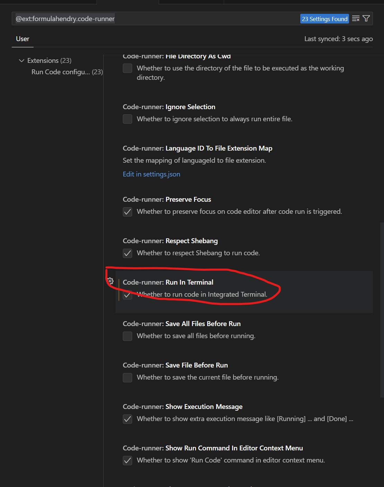
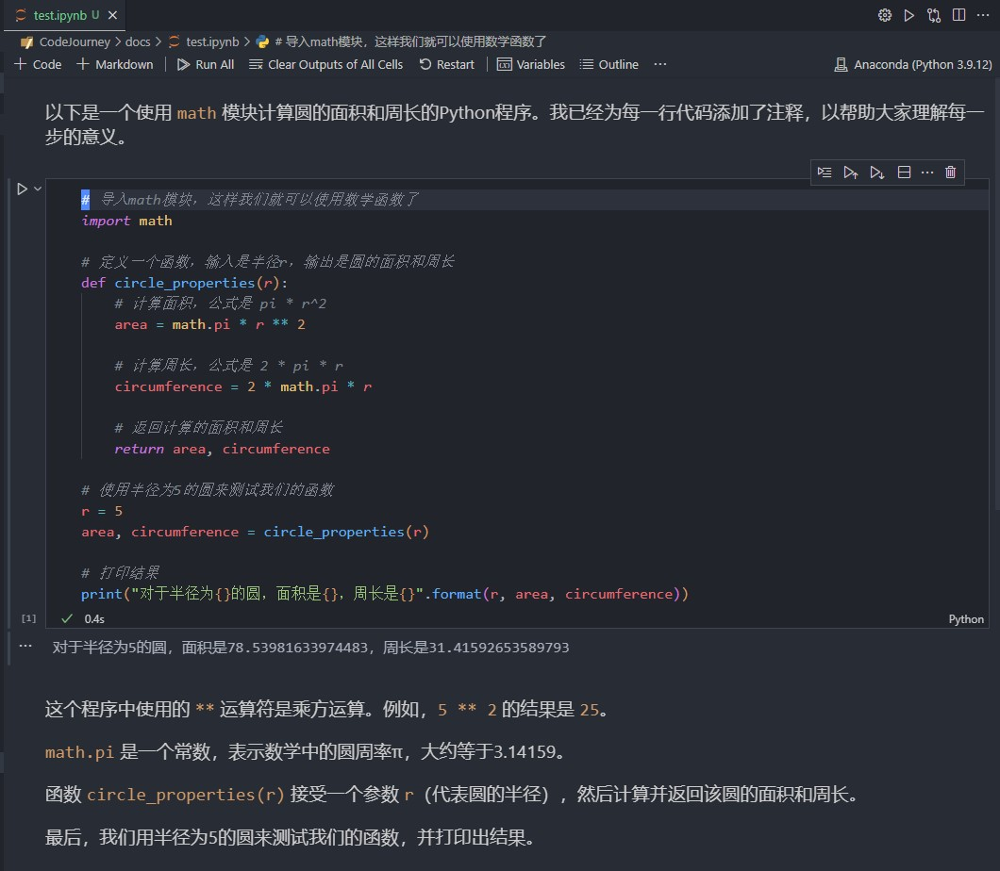

> 1.  下载 Anaconda
> 2.  安装并配置 Anaconda
> 3.  启动 Jupyter Notebook
> 4.  在 VS Code 中安装 Python 和 Jupyter 扩展
> 5.  创建并运行一个 Jupyter Notebook
> 6.  后记

本篇教学由 <u>**ChatGPT 4.0** </u>生成，不保证流程完整，缺失或与你实操不一样的部分请**自行查找信息并解决！**，锻炼自己的学习能力，这也是考验你们自学和信息辨别能力的第一个挑战。，锻炼自己的学习能力，这也是<u>考验你们自学和信息辨别能力的第一个挑战</u>。

### 如何下载 Anaconda 并运行 Jupyter Notebook

欢迎，未来的数据科学家！你将开始一段充满探索与学习的旅程。

首先，让我们迈出第一步：下载 Anaconda 并运行 Jupyter Notebook。

#### 第一步：下载 Anaconda

1. 打开你的浏览器，让我们跳入数字海洋，浏览到 [Anaconda 的官方下载页面](https://www.anaconda.com/products/distribution#download-section)。你将看到不同操作系统的版本选择，有 Windows, MacOS, 和 Linux。
2. 根据你的电脑操作系统选择相应的版本。如果你不确定电脑是 32 位还是 64 位，那就选择 64 位，因为现代电脑大多都是 64 位的。
3. 点击下载，你的电脑将开始下载 Anaconda 安装包。它可能有几百兆大小，所以耐心等待一会儿吧。下载的这段时间，你可以趁机享用一杯咖啡，或是看一下窗外的风景。

#### 第二步：安装 Anaconda

1. 找到你下载的 Anaconda 安装包，双击启动安装。这个安装包就像一扇大门，通向知识的宝库。
2. 在安装过程中，最好选择“为我安装”，然后点击“下一步”。在安装路径选择时，可以选择默认路径，或者自己设置一个容易找到的位置。
3. 当你看到选项“将 Anaconda 添加到我的 PATH 环境变量”，尽管它推荐你不要勾选，但我建议你勾选它，以便我们在任何地方都能启动 Anaconda 和 Jupyter notebook。
4. 安装完成后，你可以点击“完成”或“下一步”，以结束安装过程。

#### 第三步：启动 Jupyter Notebook

1. 现在，打开你的电脑命令行（Windows 下的 CMD，Mac 和 Linux 下的 Terminal），在闪烁的光标处输入"jupyter notebook"，然后按回车键。
2. 这个动作就像魔法一样，你的默认网页浏览器会自动打开一个新的标签页，欢迎你来到 Jupyter notebook 的世界！
3. 在这个新的标签页中，你可以看到你电脑上的各个文件夹。找到一个你喜欢的地方，点击右上角的“New”按钮，然后在下拉菜单中选择“Python 3”，你的第一个 Notebook 就诞生了！

现在，你已经成功地安装了 Anaconda，并且启动了 Jupyter Notebook！从现在开始，你就可以在这个美妙的环境中编写 Python 代码，探索数据科学的无穷魅力。祝你学习愉快，探索无限！

#### 第四步：在 VS Code 中安装 Python 和 Jupyter 扩展

1. 启动 VS Code 后，你会看到一个美观的界面，左侧栏上有一系列的图标。找到看起来像四个小方块（也可能说是一个积木）的图标，点击它，这就是扩展商店。
2. 在扩展商店的搜索框中输入“Python”，找到并点击安装微软官方的 Python 扩展。它的图标是一个蓝色的蛇形图案。
3. 同样的方式，再搜索并安装一个名为“Jupyter”的扩展。
4. 再搜索"Code Runner"，安装 Code Runner 插件，并点击右下角的齿轮中的 Extention Settings，勾选其中的 Run In Terminal。

#### 第五步：创建并运行一个 Jupyter Notebook

1. 在 VS Code 的左侧栏顶部，你会看到一个文件夹的图标，点击它，然后点击打开文件夹，选择你想要保存 Jupyter Notebook 的文件夹。
2. 然后，点击左上角的文件菜单，选择“新建文件”。在底部的状态栏中，你会看到一个选择语言的区域（可能显示为“纯文本”），点击它，然后在弹出的列表中选择“Jupyter”。
3. 新建一个后缀是`.ipynb`的文件。现在，你已经打开了一个新的 Jupyter notebook，你可以开始写 Python 代码了！在需要代码的地方输入你的 Python 代码，想记录文字的地方写 Markdown ，复制下图的内容（源代码可在本仓库的 doc 文件夹中找到），然后按 Shift + Enter，就可以运行这段代码看到结果了。

恭喜你，现在你已经在 VS Code 中设置好了 Jupyter Notebook！你可以开始你的 Python 编程和数据分析之旅了。VS Code 具有强大的代码提示，调试和版本控制功能，我相信你会喜欢在这个环境中工作的。祝你学习愉快！

#### 后记：

Jupyter 是一个非常流行的开源项目，它提供了一个交互式计算环境，让您能够在网页浏览器中创建和分享包含代码、文本、图像、公式和可视化的文档。它的名字取自三种核心编程语言：Julia、Python 和 R（即 Ju-Pyt-e-R）。

主要特点：

1. **交互性**：您可以在浏览器中逐个代码单元（称为单元格）地运行代码，即时查看结果。这种实时反馈非常适合学习、调试和数据探索。

2. **支持多种编程语言**：虽然 Jupyter 最初是为 Python 设计的，但现在它支持超过 100 种编程语言，这使得您能够在同一个环境中使用您喜欢的语言。

3. **交互性文档**：Jupyter 文档被称为“笔记本”（Notebooks），它们既可以包含代码和输出，又可以包含富文本、数学公式、图表和可视化。这使得 Jupyter 成为交互式数据分析和展示的绝佳工具。

4. **易于分享**：您可以轻松地分享您的 Jupyter 笔记本，无论是通过导出为 HTML、PDF 或通过在线共享服务（例如 GitHub、Google Colab 或 Jupyter Notebook Viewer）。

5. **广泛应用**：Jupyter 可以用于数据清理、数据分析、机器学习、科学计算、教学和其他许多领域。

请注意，Jupyter Notebook 并不是唯一的 Jupyter 项目。Jupyter 生态系统还包括 Jupyter Lab，它提供了更灵活的界面和功能，以及 JupyterHub，用于在服务器上部署 Jupyter 环境。

希望这个简介能让您对 Jupyter 有一个初步的了解。祝您在使用 Jupyter 进行编程和数据分析时取得愉快的体验！
