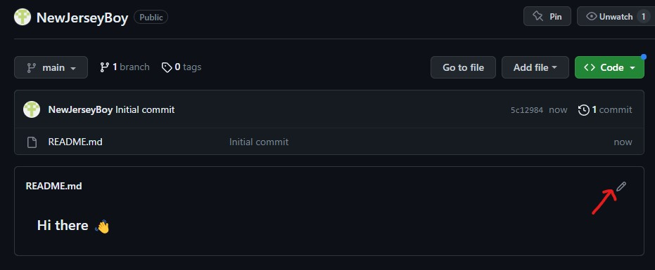
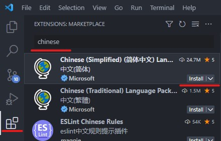
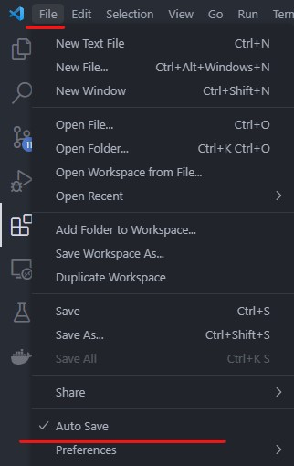
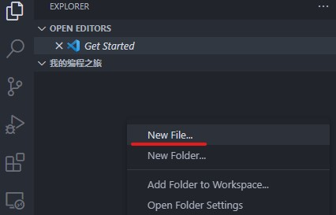
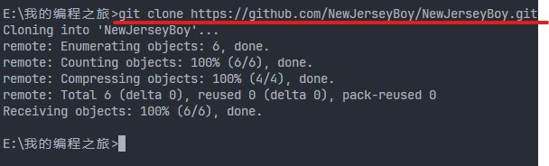
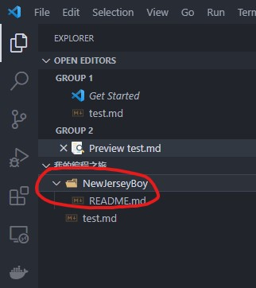
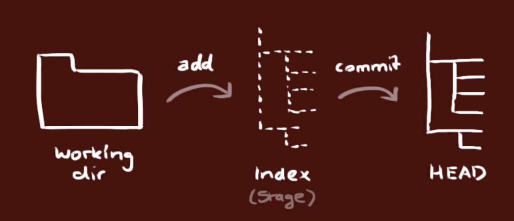

# 今天，我开始自学了！

你的第一行代码会是哪种语言？

## 莫急，看完地图再动身才不会迷路

在写代码之前，我觉得还是很有必要先弄清楚背后的原理。计算机和代码的背后到底是什么？

插上知识的翅膀，让我们一起翱翔在计算机科学的广阔天空。"Crash Course Computer Science"就是那张充满力量的飞行地图，引领你走入这个充满奇迹的世界。

你可能会问，为什么我要在编程的学习之旅的开始，就深入理解计算机科学呢？让我们来想一想：假设你是一位即将踏上未知世界的探险家，你会怎么做？你会先了解目的地的环境、地形、气候等信息，提前做好充足的准备，以免在旅途中遭遇意想不到的挑战。同样，当我们开始学习编程的时候，对计算机科学的深入了解就如同掌握了一张详尽的地图，让我们更好地理解编程的精髓，更有效地掌握编程技巧，从而避免在编程的路上迷失方向。

"Crash Course Computer Science"就是这样一份宝贵的地图。它以生动有趣的方式，将复杂的计算机科学知识变得易于理解。从二进制数到逻辑门，从数据结构到算法，从计算机硬件到软件，主讲人 Carrie Anne Philbin 女士将带你一步步揭开计算机科学的神秘面纱。无论你是完全的计算机新手，还是已经有一些编程基础的学者，你都能从这个课程中收获到知识的宝藏。在这个系列课程中，你会发现，无论是对二进制的讲解，还是对数据结构、算法的介绍，都深深地植根于计算机科学的核心知识。这一切都经过精心设计和安排，旨在让你无论在学术上还是在实践上都能从中受益。

学习编程，不仅仅是为了写出代码，更是为了理解它们背后的原理，掌握它们解决问题的思维。而本课程正是这一旅程的绝佳起点，让我们一起开启这段富有挑战、充满乐趣的学习之旅吧！

> 本课程配有制作精良的中文字幕，英文不好的小伙伴们无须担心。

传送门：[Crash Course Computer Science](https://www.bilibili.com/video/BV1EW411u7th?p=1)

> 尽管本课程以其轻松、科普的形式受到观众的喜爱，这丝毫不减其专业知识的严谨性与深度。正如彩虹吸引眼球，而彩虹背后的光谱分析却是一项深奥的科学。仅做了解即可，不要求全部理解，还是那句话，如果看这个课程打不起兴趣的话，可以跳到下一步（但最好不要哦）。

强烈建议“计算机科学”专业的同学观看本课程，之后可以跳过 Python 到“未完待续”章节，打开第一个锦囊，直接进行 C/C++的学习。

## Markdown 排版工具？编程语言？

看完地图了，我们出发吧！

在正式介绍编程之前，咱们再来聊聊排版工具，大家所熟知的 word 排版一般是先在顶部工具栏选择对于的样式，然后再编写文字，或者是编写好文字再选中后点击顶部工具栏去设置样式，不管是哪种方式，基本都需要在键盘和鼠标之间来回切换，这种书写方式断断续续的，没有流畅感

用过知乎的同学有没有好奇过，为什么别人的回答中能有多种标题，还可以嵌入好看的公式？而 Markdown 语法则是一种轻量标记语言，通过简单的语法，使普通文本具有一定的格式，能让你双手不离键盘直接写出你想要的文字和排版，给人一种超高效的沉浸式写作体验，因此很多人都爱使用 Markdown 来编写文档

Markdown 语法非常简单，[校园喵](https://xiaoyuancat.cn/)的编辑器就支持 Markdown，大家可以上手体验一下，左侧是原始文本，右侧是渲染后的效果（需要切换编辑模式为分屏预览，下面有图片教你怎么切换），从某种意义上来说，Markdown 也可以称为一种编程语言，你输入不同的标记符号，最终显示不同的效果

校园喵支持的完整的排版格式可以参考[示例](https://ld246.com/guide/markdown) ，你甚至可以画个五线谱、流程图、脑图之类的。

当然对于刚使用 Markdown 的同学来说，不用去刻意背诵所有的标记语法，记住常用的几个就行了，同时校园喵编辑器支持多种编辑模式，默认的编辑模式和 word 排版差不多，降低了大家的使用门槛

---

## 第一个任务来了！

- 下载[steam++](https://steampp.net/)
- 加速 GitHub，前往[官网](https://github.com/)，按要求注册一个 GitHub 账号。
- 创建一个**和你同名**的仓库（同名的话会有图中的提示），并勾选这几项：
  
- 创建成功后应该可以看到下图的样子，点击箭头所指位置开始编辑：
  

  可以随便写点东西在里面，然后 preview 即可看到渲染效果，最后可以把下面的代码复制进去，然后记得点击**保存**。（这里不用填写代码中的信息）

```markdown
# Hello, world! 👋🌍

My name is [你的名字], and I'm a [哪个的专业学生]!

Here's a bit about me:

- 👩‍💻 I'm currently working on: [What you're working on]
- 🌱 I'm currently learning: [What you're learning]
- 💡 I'm interested in: [Your interests]
- 💬 Ask me about: [What you're proficient in]
- 📫 How to reach me: [Your Contact Information]

## 👷 My GitHub account is:

[你想展示的文字](个人账号链接）
如：[这是 b 站官网]+(https://www.bilibili.com/)

## 📖 What I'm currently learning...

[What you're learning]随便写即可

## 💭 Let's get social...

- [Your social media links]可以写上自己的邮箱（可选）

Thanks for stopping by, and feel free to reach out if you'd like to collaborate!
```

恭喜你已经拥有了一个个人界面，别人可以通过它来了解你。

---

## 下一步，招募旅伴：vscode

想要让你的界面更好看一些吗？！请继续跟进！

(Ctrl+左键即可新标签页打开网站)

下载[Visual Studio Code](https://code.visualstudio.com/)，一般简称 vscode，一款**强大的文本编辑器**，可以理解为一个强化版的 Word，它将成为你未来编程之旅的**好伙伴之一**。

- 下载后默认的语言是英文，对于英文不好的小伙伴可能不太友好，尽管英语得学好，但平时自己用可以将语言设为中文。按下图所示即可下载**简中插件**：



- 接下来是开启自动保存，很多人都遇到过工作了半天没点保存而丢失进度这种糟心事，因为这一步至关重要！



- 还需要下载一个插件就可以继续旅行啦！请搜索并下载 Markdown Preview ，以获得即时看到自己代码的渲染效果：
- 

- 关闭并重新启动 vscode，以启用刚才所做的所有更改，现在你应该拥有了中文界面，并且可以开始写代码了！
- 在你电脑硬盘存储空间剩余较多的盘（可能是 D 盘）中新建一个空文件夹，取名为“我的编程之旅”。
- 回到 vscode，点击右上角的文件栏，选择“打开文件夹”，找到你刚才创建的文件夹，**单击**它后点击“选择文件夹”，可能会弹出信任协议，选择信任文件夹即可。
- 现在你应该可以看到左边栏中的文件夹了，右键单击栏中区域，来创建你的第一个代码文件吧！



- 给它起名叫“test.md”


- 右键文件区域，选择开启 Markdown Preview


- 把你刚才在 GitHub 上写的个人简介代码复制到文件中，Preview 栏会实时地展示你的作品（先不用填写）：


- 如果你做到这一步了，你已经证明了自己是一个自学潜力股，继续跟进吧！

---

## 招募第二个旅伴：Git

接下来你将习得三个技能：

1. 安装 Git

2. 设置 Git 的用户信息

3. 熟悉 Git 基本指令和使用流程

4. 实现你的第一次 GitHub 上传

### 1. 安装 Git（根据你的操作系统选择一个！）

- [下载 Git macOs 版](https://git-scm.com/download/mac)
- [下载 Git Windows 版](https://gitforwindows.org/)
- [下载 Git Linux 版](https://book.git-scm.com/download/linux)

以下安装和使用均指 Windows 版本下的提示：

安装包下载好后，在安装的过程中，如无需特殊需求，所有设置按照安装包提供的默认设置即可，安装的目录可以设置在自己常用的硬盘中，推荐安装在非系统盘中。

> 如需了解每一选项的大致作用，可以跳转至[Windows 下 Git 安装](https://www.bilibili.com/video/BV1Rb4y1C7z1/?spm_id_from=333.1007.top_right_bar_window_history.content.click)了解

要在新安装的 Git 上链接你的 GitHub 账户，你需要做的首要步骤是设置你的用户信息并添加 SSH 密钥，或者通过 HTTPS 方式使用凭证助手。以下是详细步骤：

### 2. **设置 Git 的用户信息：**（重点）

建议参考[知乎回答](https://zhuanlan.zhihu.com/p/193140870)

这些操作将用于你所有的 Git 提交，务必完成这步再继续操作。

### 3. 熟悉 Git 基本指令和使用流程

- 初始化新 Git 仓库（这里不用进行此操作）
  > 这项是你要创建新的 Git 仓库时使用的，这里仅了解即可

```
git init
```

- 首先，启动终端

> 点击左上方的“终端”一栏，选择“新建终端”，这会在 vscode 中启动默认的 Shell


> 确保正在操作的是当前文件夹（即编程之旅）：


- 回到 GitHub，点击绿色的 Code 按钮，复制你刚才创建的个人简介仓库链接地址：


- 然后返回 vscode 的终端，克隆（下载）你的 GitHub 简介仓库

> 在 Shell 中执行如下命令，把你刚才在 GitHub 上创建的个人简介克隆到电脑上：

```
git clone <刚才复制的仓库链接>
```

> 执行效果如下图所示



> 此时，你应该可以在文件区看到克隆下来的个人简介文件夹和里面的代码文件



- 快打开刚克隆的“README.md”文件，填写自己的信息吧！还可以利用学到的 Markdown 语法美化一下它~

<br />
<br />
<br />

在本地文件中完善自己的 GitHub 个人简介后，该怎么上传到网站上呢？

如果你有这样的疑惑，别急，下面即将提到的提交代码操作就是帮你完成上传的技能
<br />
<br />

- 简单介绍一下 Git 的工作流（理解即可）

> 你的本地仓库由 git 维护的三棵“树”组成。第一个是你的 工作目录，它持有实际文件；第二个是 暂存区（Index），它像个缓存区域，临时保存你的改动；最后是 HEAD，它指向你最后一次提交的结果。



- 首先，切换到要操作的路径：
  > 别忘了我们刚才在克隆下来的文件夹中对文件修改，因此要进入这个文件夹的路径，执行下面的命令即可：

```title="推荐方式"
cd <文件夹名>
```

或者可以尝试

```title="通配目录"
cd <文件夹名的前几个字母>*
```

无论哪种方式，确保终端中进入了当前操作的目录：


- 添加和提交
  > 你可以提出更改（把它们添加到暂存区），使用如下命令来完成：

```title="全部文件（这里用这个指令就行，注意add后有个空格）"
git add .
```

或者

```title="单个文件"
git add <filename>
```

> 执行后可能没有提示，通过输入"git status"以查看改动，全部效果如下：


> 蓝色划线是你操作的“分支名称”，记住这里是"main"还是"master"即可

这是 git 基本工作流程的第一步；使用如下命令以实际提交改动：

```title="可以写Initial commit，表示是第一次提交"
git commit -m "代码提交信息"
```

> 效果如下图即可：


现在，你的改动已经提交到了 HEAD，但是还没到你的远端 GitHub 仓库。

- 推送改动
  > 你的改动现在已经在本地仓库的 HEAD 中了。执行如下命令以将这些改动提交到远端仓库：

```title="这里的分支名应你上面查看status时显示的分支名相同"
git push origin <分支名>
```

恭喜，你完成了第一次 Git 提交代码！


## Happy Coding!

Markdown 的用途多样，包括但不限于记笔记、网站文案、文章编辑等。但不属于“正式”的编程语言，因此接下来我将向你们介绍下一个伙伴 —— Python。
